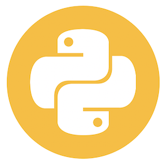

<p align="center">

</p>

<hr>

<p align="center">

</p>

# Python for Data Science
eli
# Datatieteilyä Pythonilla

## *Tavoitteet*
<p>Tässä koulutuksessa tutustutaan Python-ohjelmointiympäristöön ja sen käyttöön datan käsittelyssä ja analysoinnissa. Python on matalankynnyksen ohjelmointikieli, jolla näkee tuloksia nopeasti. Opiskelu tapahtuu pääasiassa käytännön harjoitusten muodossa, mutta aikaisempi kokemus ei ole tarpeen.</p>

<p>Koulutuksen jälkeen osallistujat ymmärtävät ohjelmointitaitojen hyödyllisyyden ja ohjelmoinnin logiikkaa. Lisäksi osallistujat oppivat toteuttamaan mm. datan käsittelyä ja ennustavaa analytiikkaa ohjelmoiden ja tietenkin hyödyntämään Pythonia moninaisissa tilanteissa.</p>

<p>Ennakkoluulottomille tekijöille skriptipohjaiset työkalut tarjoavat käytännössä rajattomat mahdollisuudet kehittää omaa osaamistaan ja tehostaa myös muiden työtä.</p>

## *Ennen koulutusta*
<p>Koulutuksessa käytämme Anacondaa, jonka voi käydä asentamassa 
  <a href="https://www.anaconda.com/distribution/">täältä</a> (3.7 versio).
  Käsiteltävät asiat on käyty läpi yo. Jupyter Notebook (<code>.ipynb</code>) -tiedostoissa (Chapters kansiossa).
</p>


Jupyter Notebook on selaimella käytettävä ohjelmointityökalu, jolla voi Pythonin lisäksi ohjelmoida useilla eri kielillä, kuten R:llä tai Julialla (vaatii tarvittavien kerneleiden asentamisen). Monista muista kehitysympäristöistä poiketen Jupyter Notebook mahdollistaa tekstin, kuvan ja koodin yhdistämisen, joka on mahdollista myös R-Notebook formaatissa. Notebookin sisältö (esim. raportti) on helppo jakaa muille esim. HTML-, PDF- tai Markdown-muodossa. IPYNB-formaatissa olevaa Notebookkia voi myös katsella sellaisenaan versionhallinnan verkkosivulle, kuten GitHubissa.

## *Anacondan kanssa toimiminen*
<p>Yleensä on järkevää luoda erillisiä Python virtuaaliympäristöjä, joissa hallinnoidaan kirjastoja toisistaan erillään. Näin voidaan varmistua siitä että asennetut kirjastot toimivat yksiin ja että versiot ovat oikeita. Uuden ympäristön luonti onnistuu Anacondalla seuraavasti (järjestelmän komentorivillä):</p>

```bash
conda create -n my_env
```

jossa `my_env` on luotavan ympäristön nimi. Jotta uutta ympäristöä voidaan käyttää Jupyter:issa, on ensin asennettava IPython kerneli:

```bash
pip install --user ipykernel
```

ja sen jälkeen voidaan lisätä uusi ympäristö Jupyter:iin:

```bash
python -m ipykernel install --user --name=my_env
```
Tämän jälkeen uusi ympäristö on valittavissa Jupyter:issä *Kernel*-valikosta.

Kun halutaan asentaa Python kirjastoja asentaa uuteen ympäristöön, pitää se ensin aktivoida:

```bash
conda activate my_env
```

Ja sen jälkeen uuden kirjaston asennus onnistuu joko `conda install` tai `pip install` kommennolla.


## *Sisältö*
<p>Tämä koulutus ei ole johdatus Python-ohjelmointiin yleensä, vaan siihen miten Pythonia 
  käytetään datan analysointiin ja mallintamiseen. Koulutuksen sisältö noudataa 
  seuraavaa rakennetta:</p>

1. Datarakenteet ja tietotyypit  
2. Dataoperaatiot, funktiot ja metodit  
3. Visualisointi  
4. Tilastollinen testaus  
5. Edistynyt analytiikka
6. Neuroverkot

## *Lisätietoa*
Alla muutamia verkkosivuja, joista löytää lisää tietoa aiheesta. Vastaavia sivuja on tarjolla valtavasti. Lisäksi, "Cheatsheets" -kansiosta löytyy pdf-tuedostoja, joissa on koottuna Python käskyjä eri tarpeisiin.

- https://www.pythoncheatsheet.org/  
- https://realpython.com/tutorials/data-science/  
- https://www.datacamp.com/courses/intro-to-python-for-data-science  
